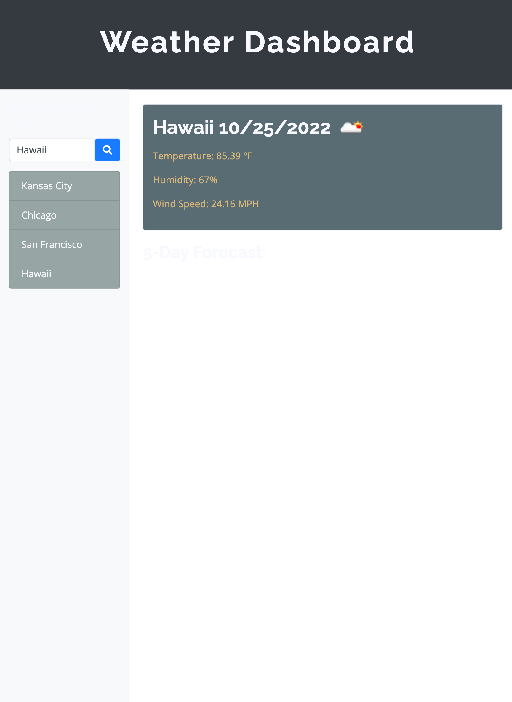

# Weather Dashboard
Module 6 Challenge
## Description
This application is a weather forecast dashboard that can help with users to see the weather outlook for multiple cities. So that they can plan a trip accordingly.
[Link](https://zhngzh527.github.io/Weather-Dashboard/)

I have using those technologies to create the web application:
- HTML & CSS
- JaveScript
- BootStrap
- Server-Side API (OpenWeather API)

## Application Screenshot
